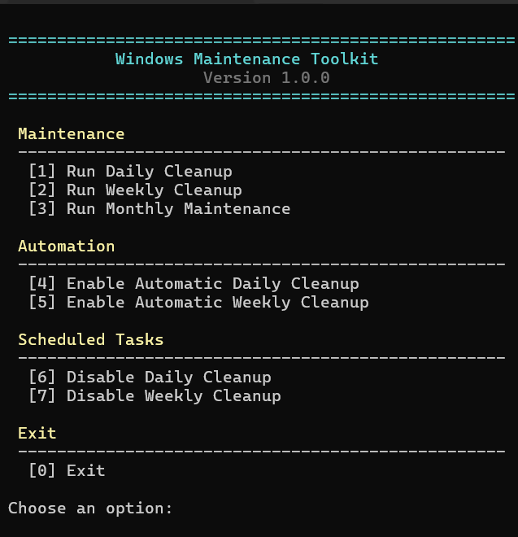

# Windows Maintenance Toolkit

🌎 **Looking for the Portuguese version?**
➡️ [README.pt-BR.md](README.pt-BR.md)

A lightweight PowerShell toolkit that helps keep Windows development machines clean and optimized.

This project provides automated maintenance scripts that safely remove temporary files, clean development caches, and perform routine system maintenance without affecting personal files or projects.


## Preview



---

## Features

- Daily cleanup of temporary files
- Recycle Bin cleanup
- Thumbnail cache cleanup
- DNS cache flush
- Weekly Docker cleanup (if installed)
- npm cache verification
- pnpm store cleanup (if installed)
- Windows maintenance with DISM and SFC
- WSL support
- Automatic Task Scheduler integration
- Execution logs

---

## Project Structure

```text
windows-maintenance-toolkit/
│
├── scripts/
│   ├── Daily.ps1
│   ├── Weekly.ps1
│   └── Monthly.ps1
│
├── logs/
│
├── Menu.ps1
├── Start.bat
├── README.md
├── README.pt-BR.md
└── LICENSE.txt
```

---

## Available Maintenance

### Daily Cleanup

Runs a safe cleanup including:

- User temporary files
- Windows temporary files
- Recycle Bin
- Thumbnail cache
- Local temporary files
- DNS cache

Recommended frequency:

> Daily

---

### Weekly Cleanup

Includes everything from Daily Cleanup plus:

- Docker cleanup (only unused resources)
- npm cache verification
- pnpm store cleanup (if installed)

Recommended frequency:

> Weekly

---

### Monthly Maintenance

Includes:

- Windows Component Cleanup (DISM)
- System File Checker (SFC)
- WSL shutdown

WSL virtual disk optimization is intentionally disabled by default and must be configured manually.

Recommended frequency:

> Monthly

---

## Automatic Scheduling

The toolkit can automatically create Windows Scheduled Tasks.

Available options:

- Daily Cleanup at user logon
- Weekly Cleanup every Sunday

Tasks can also be removed directly from the menu.

---

## Safety

This toolkit **does not delete**:

- Personal files
- Documents
- Downloads
- Source code
- Development projects
- Pictures
- Videos

Only temporary files, caches and unused development resources are removed.

Always review the scripts before running them.

---

## Requirements

- Windows 10 or Windows 11
- PowerShell 5.1+
- Administrator privileges

Docker, npm and pnpm are optional.

---

## Running

Open:

```text
Start.bat
```

Choose one of the available options from the interactive menu.

---

## License

MIT License
